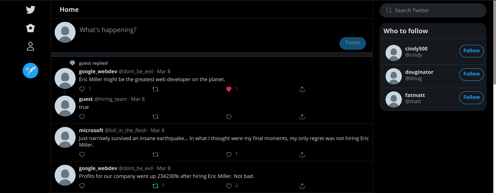

# Twitter Clone

Eric Miller

[Try it out here](https://twitter-clone-ericmiller.herokuapp.com/
)

- Guest login: Username: guest, Password: password123
- Ruby version: 2.7.0p0
- Database:  postgresql

## Implemented Features

- Tweets
- Replies
- Likes
- Retweets
- Follow other users
- See profiles
- Search posts

## Features in progress

- signup / create account
- Quote Tweets
- Edit Avatar Image
- User popups on hover
- media
- dm

## My todo list 

- profile avatar, background image, follow button

- current_user avatar in newtweet should link to profile, and in mobile opens navigation as a modal halfway accross the screen

- avatar modal

- rework application.html.erb and make everything a react component

- clicking on likes, retweets should pop up a modal showing users

- add quote-tweet function
clicking on quote_tweets loads new page showing each one (comment plus quote)

- abbreviate handles in suggested-section when too long

- make search index pretty

- add delete tweet option

- Add signup

- Expand Nav with Labels

- Make back button on TopHeader not just go back a page

- Work on Responsiveness

## Personal Project Design Notes

### Thoughts on ActiveRecord Associations setup:

Single Table Inheritance with subclasses
Tweets Retweets and QuoteTweets are subclasses of Post (post is what tweet is now)
(Cons: empty extra columns)

Potentially overkill...?
What is the benefit over just leaving inheritance out of it and just removing Retweet/QuoteTweet classes?
It does seem easier to grab retweets, quote_tweets without needing another column for og tweet id to find quote_tweets since they're all the same class. Very small benefit though.

OR

NOT COMING UNTIL RAILS 6.1
Rails Delegated types? STI with delegated child companion object
https://belighted.com/blog/implementing-multiple-table-inheritance-in-rails
https://github.com/rails/rails/pull/39341

### Other

Multiple replies to one tweet in feed:
-what happens if multiple replies to one tweet? just show one reply and one reference to the parent on the feed
-replies under status: chains of replies (2+ generations) get chained with the reply connector under status, show up to 3 total tweets chained? with link below to show more?
